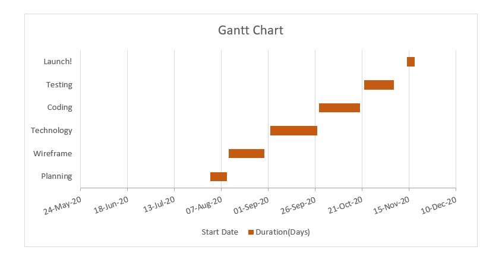

<h3 align="center"> PROJECT TOPIC: HOUSE RENTAL MANAGEMENT</<h3>

 

 
 ## Project Group Members:
 1. Mohan Agrawal (18/181500385-D)                                           
 2. Udit Aggarwal (35/181500765-D)
 3. Madan Mohan (16/181500354-D)
 4. Amit Kumar (06/181500084-I)
 5. Bhagat Singh (19/181500189-G)
 Project Supervisor: Ms. Harvinder Kaur, Senior Technical Trainer

## Introduction:
House rental management has become important factor in modern society hence the need to have rental management system. Mainly, house rental has a central importance to quality of life with considerable economic, social, cultural and personal significance. Though a country’s national prosperity is usually measured in economic terms, increasing wealth is of diminished value unless all can share its benefits and if the growing wealth is not used to redress growing social deficiencies, one of which is housing. Rental plays a huge role in revitalizing economic growth in any country among key indicators of development.
The focus of this project is to managing the house for low income, medium and high incomes articles or what is commonly known as affordable housing. ’Affordable’ is a term used to describe individual’s capability to pay for certain products or services because their income is enough to do so.
Most families choose house based on their income and family situation; unfortunately, there may not be enough good quality house for these families.
Bihar accounted for one third of the housing scarcity followed by Andhra Pradesh, Assam, up and west Bengal. In 2000, about 48.7 million people were living in urban slums in unhealthy conditions. According Ninth Five-year plan ,18.77 million houses are kutcha house so they are unable to face the natural disaster like cyclone and floods etc.
In area of computer science, it may be major project because it fulfills the requirement of society and give many more advantages to them relates their housing problems. I think that in future most of people live on rent due to lack of land resources. It is also different idea because we can reuse the things that become obsolete for others.

## Hardware requirement:

- PC with 4GB RAM,500 GB HDD
   
## Software requirement:

•	XAMPP web server 1.0.0.0
•	VS code editor 1.46.1.0
•	GitHub Repository

  

## PROBLEM DEFINITION:
It meets the requirement of houses to the families according to their requirement. Actually, Rental has become a problem for most of the person because of growing population. People migrate from one city to other cities for finding job, but in beginning, everyone needs house that can only be available with the help of rent. It is very difficult to find well stable house in strange place. Increased number of tenants and landlords makes management difficult especially for the landlords who are losing huge sum of money through tenants who evade rent. It gives the clear declaration as to why rental house management system need to be developed. 

## OBJECTIVE: 
1. To produce a web-based system that allows the vendors and tenants to register and book a house for rent to effectively manage their business.
2. The owner easily maintains the data like payment of tenant that is difficult for older days.
3. To ease vendor’s task whenever they give house on rent.  

## TECHNOLOGIES:

- HTML5, CSS, JavaScript/jQuery, PHP 7.1.33.0, MySQL database

## METHODOLOGY:

It outlines how data will be collected and tools for collecting data. Model view controller (MVC) is software design for developing web applications. It consists three parts like

1. Model -The lowest level of the pattern which is responsible for maintaining data.
2. View-It is responsible for displaying all or a portion of the data to the user.
3. Controller-Software code that controls the interaction between model and view.

MVC isolates the application logic from the user interface layer and supports separation of concern. Here controller receive all requests for the application and then work with model to prepare any data needed by the view. The view then uses the data prepared by the controller to generate a final presentable response. It can be understood with the following diagram.

 

## IMPLEMENTATION DETAILS:

This project is divided into seven modules for ease of access of development.
  
1. Registration(signup):  In this module, owner of house or user fill the registration form for using house management services.
2. Owner Details form:  Owner fills their house detail like no of rooms available, area of house, location, city, rent fees and also some other details.
3. Searching:  This feature is used by tenant/user for finding the house as per their need. It can find house on the basis location, rent fees, no. rooms needed.
4. Tenant details form:  After searching the house as per requirements. Customer fill details like username, Aadhar number, no. of rooms, contact no, Security fees, no. of people, purpose of leaving and other also may be.
5. View Information page:  Owner check the information of tenants that he/she paid rent or not and show also due amount of rent. If any tenant does not pay the rent on time, then owner can give notice to him/her through Gmail. 
6. Transaction:  It is used by tenant for paying the rent.
7. Authentication:  It is used only for security purpose of the system. Everyone enters into system only through login page.
         
## PROJECT PLANNING:   
                                                                                         
   

## CONTRIBUTION SUMMARY:

To develop this project, we need two types of technologies front-end and Back-end. Front-end contains the outlook of any web page and Back-end makes pages dynamic in nature. Our Project divide into five modules where each module created by individual member.
Mohan Agrawal:  Related to account information like registration and authentication pages will be developed with this.
Amit Kumar:  Maintains the owner details form and also its sub-modules that is related to owner.
Bhagat Singh:  Covers searching module that is necessary part of rental house management because it gives the filtering house information to the user.
Udit Aggarwal:  It maintains the tenant information’s so that user information keeps safe and use properly for database.
Madan Mohan:  It covers the transaction system process and Rent view information pages.  

 The Home page of web application will be developed with help of team members. As, we are team so we also help each other if there is any problem in different modules.

## REFERENCES:

Erguden, S. (2001), Low cost housing policies and constraint in developing countries.
https://www.ehow.com
https://www.researchgate.net

    Signature of Project Guide:  

